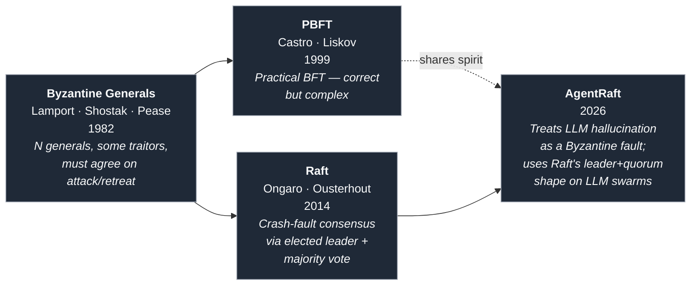
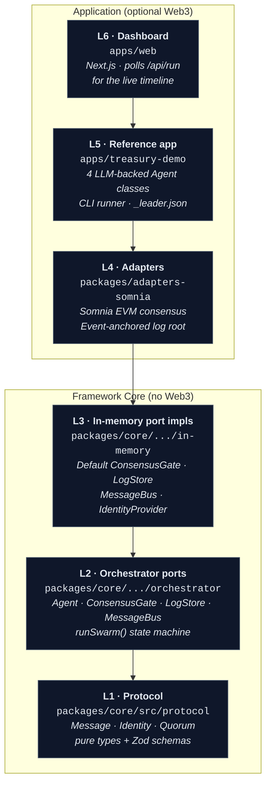
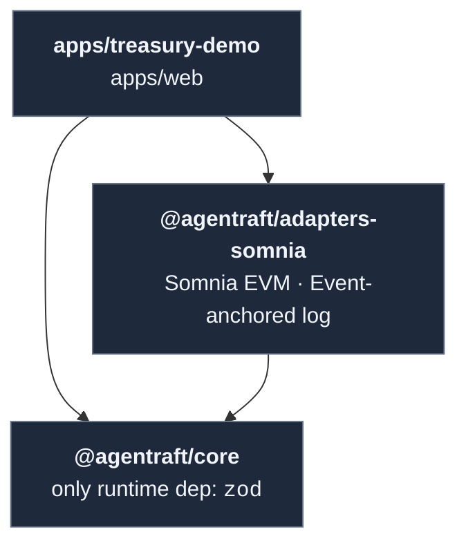
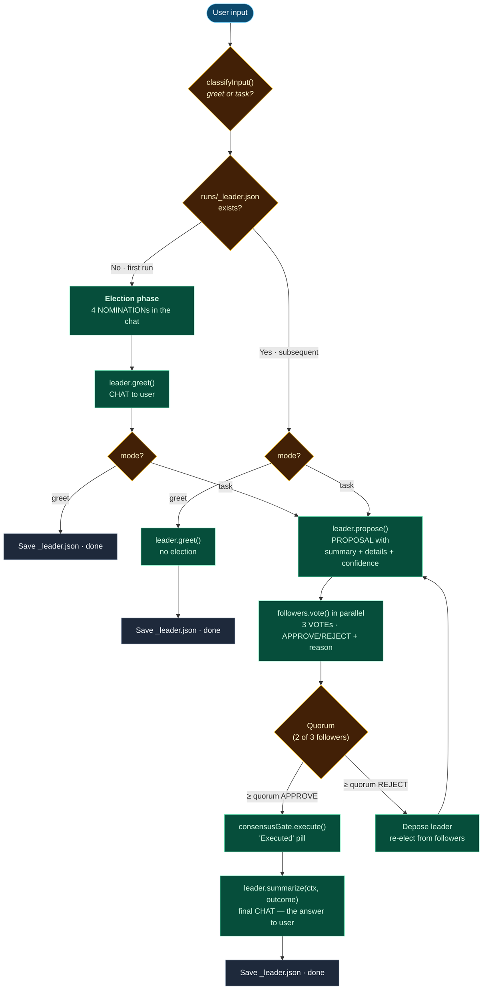

# AgentRaft

**RAID for AI agents.** A fault-tolerant multi-agent protocol that applies Raft-like consensus to LLM swarms: a leader proposes, followers vote, and a quorum can depose a leader whose proposal is unsafe. AgentRaft makes Byzantine faults — the silent hallucinations that propagate unchecked through today's multi-agent systems — both detectable and recoverable, with the entire decision trail anchored to verifiable storage.

The protocol is deliberately split: **a framework-agnostic core library** (`packages/core`) and **drop-in adapters** for EVM L1 backends like Somnia (`packages/adapters-somnia`). Anyone can run AgentRaft on their own agents without taking on a Web3 dependency.

This repo is the [Somnia Agentathon](https://www.encodeclub.com/programmes/agentathon) submission, built on Encode Club's programme with Somnia as the chain backend. The reference app `apps/treasury-demo` is one concrete instantiation; the same framework runs any domain.

> 📄 **Research paper:** the full protocol, threat model, and consensus argument are published on Zenodo — **["AgentRaft: Raft-Inspired Byzantine Fault Tolerance for LLM Agent Swarms"](https://zenodo.org/records/20017799)**.

---

## The big idea — "Agents in a group chat, with rules"

If you've used **WhatsApp** or any group chat, you already understand 90% of AgentRaft. The other 10% is what makes it useful for *decisions*.

### Agents are OOP objects

An agent is a TypeScript class implementing the `Agent` interface ([`packages/core/src/orchestrator/ports.ts`](packages/core/src/orchestrator/ports.ts)). The contract is small:

```ts
interface Agent {
  id: string;
  role: 'leader' | 'follower';
  nominate?(ctx): Promise<NominationResult>;          // optional — used in elections
  greet?(ctx):    Promise<{ text: string }>;          // optional — leader says hi
  propose?(ctx):  Promise<{ payload: ProposalPayload }>; // only if you might be leader
  vote(proposal, ctx): Promise<{ payload: VotePayload }>; // required
  summarize?(ctx, outcome): Promise<{ text: string }>;  // optional — final user-facing reply
}
```

Each instance is **stateful** and encapsulates its own behavior — LLM prompts, policy rules, retrieval calls, whatever you like. The reference app ships four such classes:
- [`LeaderAgent`](apps/treasury-demo/src/agents/leader.ts) — Coordinator
- [`RiskAgent`](apps/treasury-demo/src/agents/risk.ts) — Critic
- [`ComplianceAgent`](apps/treasury-demo/src/agents/compliance.ts) — Strategist
- [`MarketAgent`](apps/treasury-demo/src/agents/market.ts) — Analyst

You can drop in your own with one class.

### Messages are chat in a shared room

Every action an agent takes becomes a typed message broadcast to a shared `MessageBus`:

| Type | Sender | Meaning |
|------|--------|---------|
| `NOMINATION` | any agent | "I nominate X for leader" |
| `CHAT` | leader (greet/summary) or user | free-text address |
| `PROPOSAL` | leader | structured recommendation (summary + details + confidence) |
| `VOTE` | follower | APPROVE / REJECT + one-sentence reason |
| `VOTE_NEW_LEADER` | follower | "depose this leader" |

All agents subscribe. The dashboard subscribes. The on-chain log subscribes. **Everyone sees every message** — exactly like a group chat ([`apps/web/components/Conversation.tsx`](apps/web/components/Conversation.tsx) is just rendering this stream).

The difference from a real chat: messages are **typed payloads** with Zod schemas ([`packages/core/src/protocol/message.ts`](packages/core/src/protocol/message.ts)) and the room enforces a **consensus protocol**.

### Raft, not chaos

The state machine in [`runSwarm()`](packages/core/src/orchestrator/swarm.ts) imposes Raft-style discipline on the chat:

- **Election** — agents nominate, majority wins, ties break by list order
- **Term (epoch)** — every proposal lives in a numbered epoch; deposition advances it
- **Quorum** — 2-of-3 of followers must approve to execute ([`TwoThirdsQuorum`](packages/core/src/protocol/consensus.ts))
- **Deposition** — 2-of-3 rejects rotate the leader; the new leader persists across tasks via `runs/_leader.json`

This is what makes the swarm **fault-tolerant**: a hostile or hallucinating agent cannot push a bad proposal through alone, and a chronically bad leader gets rotated out.

---

## Where leader selection comes from — the Byzantine Generals problem

The protocol didn't drop out of the sky. It descends from a 44-year-old line of distributed-systems research.



### The Byzantine Generals Problem (1982)

Lamport, Shostak, and Pease asked: *how do N generals besieging a city agree on a coordinated attack when some of them may be **traitors** — sending different messages to different recipients, lying about their intentions, or trying to split the loyal generals?* The result: agreement is impossible if traitors are 1/3 or more of the group; below that, complex multi-round protocols suffice. This is the **strongest** failure model in distributed systems — a *Byzantine* fault is any arbitrary deviation, including outright lies.

### Raft (2014) — making consensus understandable

PBFT (1999) solved BFT practically, but it was famously hard to implement and reason about. Raft took a **simpler problem** — *crash-fault* tolerance, where nodes may halt but never lie — and produced a protocol designed primarily for understandability: one elected leader per term, log replication, majority vote, leader rotation on failure. Almost every modern system that needs strong consensus (etcd, Consul, CockroachDB, TiKV) runs Raft underneath.

### AgentRaft (2026) — applying Raft's shape to LLM hallucinations

LLM swarms have a failure model that sits between crash-fault and full Byzantine: agents don't crash (they always reply), but they **hallucinate** — producing confidently wrong outputs that look identical to correct ones. A naive "majority vote on the LLM's answer" doesn't help if every agent is fed the same hallucinated context.

AgentRaft borrows Raft's **structural ingredients** — elected leader, numbered epochs, follower votes, quorum-based execution, deposition on rejection — but treats each agent's vote as a **specialized check** rather than a duplicate verification. The Critic, Strategist, and Analyst are *deliberately different* perspectives: a hallucinated Coordinator proposal only passes if it survives three independent, role-distinct evaluations.

The full argument — why the loyal-majority assumption applies to a panel of role-diverse LLMs, and what attack vectors remain — is in the [Zenodo paper](https://zenodo.org/records/20017799).

---

## Architecture — the layers



### Package dependency boundary



Grouped at the package level, the six layers collapse to three concerns:

| Concern | Lives in | Web3 deps |
|---------|----------|-----------|
| **Protocol** (L1) | `packages/core/src/protocol/` | none |
| **Orchestration** (L2 + L3) | `packages/core/src/orchestrator/` | none |
| **Application** (L4 + L5 + L6) | `packages/adapters-somnia/`, `apps/*` | yes (optional) |

The boundary is enforced: `packages/core/package.json` declares **`zod` as its only runtime dependency**, and CI guard [`scripts/check-core-deps.mjs`](scripts/check-core-deps.mjs) fails the build if anything else gets added.

### Layer by layer

- **L1 — Protocol.** [`message.ts`](packages/core/src/protocol/message.ts), [`identity.ts`](packages/core/src/protocol/identity.ts), [`consensus.ts`](packages/core/src/protocol/consensus.ts). Pure types with Zod validation. Zero runtime deps beyond Zod.
- **L2 — Ports.** Interfaces only ([`ports.ts`](packages/core/src/orchestrator/ports.ts)). The whole point: a downstream impl can be in-memory, on-chain, federated, REST-backed — same orchestrator code calls it.
- **L3 — In-memory.** [`InMemoryConsensusGate`](packages/core/src/orchestrator/in-memory/consensus-gate.ts), [`InMemoryLogStore`](packages/core/src/orchestrator/in-memory/log-store.ts), [`InMemoryMessageBus`](packages/core/src/orchestrator/in-memory/message-bus.ts), [`InMemoryIdentityProvider`](packages/core/src/orchestrator/in-memory/identity-provider.ts). Production-quality defaults; the entire test suite + the reference demo run on these.
- **L4 — Adapters.** [`packages/adapters-somnia`](packages/adapters-somnia/) swaps consensus and log anchoring onto Somnia's Shannon testnet (EVM L1, chainId 50312, sub-second finality): [`SomniaChainConsensusGate`](packages/adapters-somnia/src/somnia-chain-consensus-gate.ts) turns propose/vote/depose/execute into real on-chain transactions, [`SomniaEventLogStore`](packages/adapters-somnia/src/somnia-event-log-store.ts) anchors each sealed batch's keccak256 root via the `LogBatchSealed` event, and [`SomniaChainIdentityProvider`](packages/adapters-somnia/src/somnia-chain-identity-provider.ts) reads the on-chain agent registry. Solidity sources in [`packages/adapters-somnia/contracts/`](packages/adapters-somnia/contracts/).
- **L5 — Reference app.** [`apps/treasury-demo/src/agents/`](apps/treasury-demo/src/agents/) — four ~150-line agent classes wired to OpenAI tool-calling. Easy to copy.
- **L6 — Dashboard.** [`apps/web`](apps/web) — Next.js 14 App Router; polls the JSONL files the demo writes.

---

## Agent orchestration — the runtime flow

When you submit input, this is what happens end to end.



**Key takeaways:**
- The election is visible **only on the first run**. Every subsequent task reuses the elected leader — no re-introduction noise.
- A leader is rotated only by **mid-task deposition** (2/3 reject). The new leader persists into the next run.
- `summarize()` is the leader's **final user-facing message** — it's the actual answer to the task, synthesized from the proposal + votes + outcome.

Key files driving this:
- [`apps/treasury-demo/src/index.ts`](apps/treasury-demo/src/index.ts) — CLI entrypoint, `classifyInput()`, reads/writes `_leader.json`
- [`packages/core/src/orchestrator/swarm.ts`](packages/core/src/orchestrator/swarm.ts) — the `runSwarm()` state machine

The first-run election is **visible by design** — the user watches their team form. Every subsequent task reuses the elected leader (no re-election, no re-introduction noise). A new leader emerges only when 2/3 followers depose the current one mid-task, and that new leader sticks for the next run too.

---

## Quickstart — Bring-Your-Own-Agent (no Web3 required)

```bash
pnpm install
pnpm --filter @agentraft/core build
```

```ts
import {
  runSwarm,
  InMemoryLogStore,
  InMemoryConsensusGate,
  InMemoryMessageBus,
  InMemoryIdentityProvider,
  type Agent,
} from '@agentraft/core';

const leader: Agent = {
  id: 'leader', role: 'leader',
  async propose() {
    return { payload: { proposalId: 'p1', actionHash: '0xabc', action: { kind: 'ship_it' } } };
  },
  async vote() { throw new Error('leader does not vote'); },
};

const reviewer = (id: string): Agent => ({
  id, role: 'follower',
  async vote(p) {
    return { payload: { proposalId: p.payload.proposalId, decision: 'APPROVE' } };
  },
});

const agents = [leader, reviewer('r1'), reviewer('r2')];

const outcome = await runSwarm({
  agents,
  identityProvider: new InMemoryIdentityProvider(agents.map(a => ({ id: a.id, role: a.role }))),
  logStore: new InMemoryLogStore(),
  consensusGate: new InMemoryConsensusGate({ agents: agents.map(a => a.id), initialLeader: 'leader' }),
  messageBus: new InMemoryMessageBus(),
  task: 'ship release v1',
});

console.log(outcome); // { status: 'executed', epoch: 0, actionHash: '0xabc', logRef: '0x...' }
```

That's the whole framework — no chain, no LLM keys, nothing else to install. Swap any of the four ports for your own implementation and the orchestrator does not care.

**BYO matrix:**

| Port | Default | BYO examples |
|------|---------|--------------|
| `Agent` | your code | OpenAI, Anthropic, local model, hardcoded policy |
| `ConsensusGate` | `InMemoryConsensusGate` | `SomniaChainConsensusGate`, any other EVM chain, multi-region quorum |
| `LogStore` | `InMemoryLogStore` | `SomniaEventLogStore`, S3, Postgres, IPFS |
| `MessageBus` | `InMemoryMessageBus` | Redis pub/sub, NATS, websockets, on-chain events |

---

## Run the reference app

The reference app is a generic 4-agent decision swarm. Submit anything — "Should we adopt React 19?", "I'm thinking of buying SOL", "What's the right architecture for X?" — and the swarm deliberates.

```bash
pnpm install
pnpm -r --filter './packages/*' build
pnpm --filter treasury-demo build

# CLI run (single task)
pnpm --filter treasury-demo start -- --task "Should we migrate to Postgres?"
```

Each run drops these into `apps/treasury-demo/runs/<timestamp>/`:
- `messages.jsonl` — the full message stream (the "chat")
- `events.jsonl` / `events.json` — the on-chain-equivalent event log
- `outcome.json` — the final state (`executed` / `halted` / `greeted`)
- `status.json` — current phase indicator (drives the dashboard's "thinking" state)

A persistent `apps/treasury-demo/runs/_leader.json` tracks who's currently leader across runs.

### The four reference agents

| Agent | Role | What it weighs |
|-------|------|----------------|
| **Coordinator** (`leader`) | orchestrates discussion, proposes solutions | overall coherence, actionability |
| **Critic** (`risk`) | challenges assumptions, finds blind spots | risks, missing pieces, faulty assumptions |
| **Strategist** (`compliance`) | evaluates feasibility | tradeoffs, long-term fit, practical constraints |
| **Analyst** (`market`) | provides research-driven perspective | data, context, domain knowledge |

Each follows the same shape: `nominate` → `greet` (if elected) → `vote` → `propose` (if elected) → `summarize` (if elected). OpenAI tool-calling enforces structured outputs.

---

## The live dashboard

```bash
pnpm --filter agentraft-web build
pnpm --filter agentraft-web start
# → http://localhost:3000
```

The dashboard polls the most recent `runs/` directory every 600ms and live-renders the chat stream, vote tally, and chain events.

Two input modes:

- **Run Swarm** (default) — full deliberation. Triggers a fresh `runSwarm()` cycle: election (if first run) → propose → vote → summarize. All four agents participate.
- **Quick Ask** (appears after the first run) — single-leader follow-up. Only the current leader replies, using the chat history as context. For "what did you mean by X" type clarifications, not for new decisions.

The agent roster sidebar shows the current leader and the per-agent stats (proposals / approvals / rejections / election votes).

---

## Somnia Integration

[Somnia](https://somnia.network/) is a high-throughput EVM L1 with sub-second finality — a natural fit for an agent swarm where every propose / vote / depose is a real on-chain action. `packages/adapters-somnia` ports the four AgentRaft ports onto Somnia's Shannon testnet (chainId `50312`):

| Somnia Service | Where it appears | Adapter |
|------------|------------------|---------|
| **Somnia EVM (consensus)** | `SwarmConsensus.sol` — propose, vote, depose, execute as on-chain transactions | [`SomniaChainConsensusGate`](packages/adapters-somnia/src/somnia-chain-consensus-gate.ts) |
| **Somnia EVM (identity)** | `AgentRegistry.sol` — stake-gated agent set with role tags | [`SomniaChainIdentityProvider`](packages/adapters-somnia/src/somnia-chain-identity-provider.ts) |
| **Log anchoring** | Each sealed batch's keccak256 root committed via the `LogBatchSealed(epoch, ref)` event | [`SomniaEventLogStore`](packages/adapters-somnia/src/somnia-event-log-store.ts) |

The full message body stays in local JSONL files; only the root hash hits the chain. That gives "**chain-anchored root, locally-archived body**" — every JSONL file is provably linked to a Somnia block, and any tamper at the byte level fails verification against the on-chain ref.

### Deploy the contracts

```bash
cp .env.example .env
# fill in DEPLOYER_PRIVATE_KEY (Shannon testnet faucet: https://testnet.somnia.network/)
pnpm --filter @agentraft/adapters-somnia hardhat:compile
pnpm --filter @agentraft/adapters-somnia hardhat:test       # 7 tests, all paths
pnpm --filter @agentraft/adapters-somnia deploy:testnet     # writes deployments.50312.json
```

The deploy script registers three signers as `leader`, `risk`, and `compliance` agents (each posting `0.001 STT` stake), then deploys `SwarmConsensus` wired to that registry. A `deployments.50312.json` file is written so the demo can pick up the addresses automatically.

### Live on Somnia Shannon testnet

| Contract | Address | Explorer |
|---|---|---|
| **AgentRegistry** | `0xa8420E95A6D43489f6BcD5699E13C2EC7A635d06` | [view](https://shannon-explorer.somnia.network/address/0xa8420E95A6D43489f6BcD5699E13C2EC7A635d06) |
| **SwarmConsensus** | `0x9476f7Be5A42F2d6f3186eED7f00F1fEf2c18AF6` | [view](https://shannon-explorer.somnia.network/address/0x9476f7Be5A42F2d6f3186eED7f00F1fEf2c18AF6) |

Both deployed via `deploy:testnet` on chainId `50312`; see [`packages/adapters-somnia/deployments.50312.json`](packages/adapters-somnia/deployments.50312.json) for the full deployment record.

---

## Project layout

```
maestro/
├── packages/
│   ├── core/                       # @agentraft/core — L1 + L2 + L3, zero Web3 deps
│   │   ├── src/
│   │   │   ├── protocol/           # L1: message, identity, consensus types
│   │   │   └── orchestrator/       # L2 + L3: ports, runSwarm, in-memory defaults
│   │   └── test/                   # Vitest specs (protocol + runSwarm lifecycle)
│   └── adapters-somnia/            # @agentraft/adapters-somnia — L4 Somnia adapters
│       ├── src/                    # SomniaChainConsensusGate, SomniaEventLogStore, etc.
│       └── contracts/              # SwarmConsensus.sol, AgentRegistry.sol
├── apps/
│   ├── treasury-demo/              # L5: reference 4-agent app
│   │   └── src/agents/             # leader, risk, compliance, market, nomination, llm
│   └── web/                        # L6: Next.js dashboard
│       ├── app/api/                # /api/run, /api/run/start, /api/chat
│       └── components/             # AgentRoster, Conversation, CommandBar, ProposalHeader
├── scripts/
│   └── check-core-deps.mjs         # CI guard: core may only depend on zod
├── pnpm-workspace.yaml
└── README.md
```

---

## Getting started

```bash
# 1. install
pnpm install

# 2. set your OpenAI key (required for the reference agents)
cp .env.example .env
# edit .env: OPENAI_API_KEY=sk-...
# optional Somnia: DEPLOYER_PRIVATE_KEY=...  (only needed for adapters-somnia hardhat scripts)

# 3. build all packages
pnpm --filter @agentraft/core build
pnpm --filter treasury-demo build
pnpm --filter agentraft-web build

# 4. run the dashboard
cd apps/web && pnpm start
# → http://localhost:3000
```

Submit "hi" first to watch the election happen, then ask any real question. Subsequent questions reuse the elected leader.

---

## Verification

| Check | Command | Expected |
|-------|---------|----------|
| Core unit tests | `pnpm --filter @agentraft/core test` | 8 passing |
| Contract tests | `cd packages/adapters-somnia && npx hardhat test` | 7 passing |
| Core dep guard | `node scripts/check-core-deps.mjs` | `packages/core deps OK` |
| End-to-end demo | `pnpm --filter treasury-demo start -- --task "test"` | `outcome.json` with `status: executed` |
| Dashboard | `pnpm --filter agentraft-web start && curl localhost:3000/api/run` | JSON with non-empty `events` / `messages` after a run |

---

## Research

The protocol and its threat model are formalized in a companion paper:

> **AgentRaft: Raft-Inspired Byzantine Fault Tolerance for LLM Agent Swarms**  
> Published on Zenodo · 2026  
> 🔗 https://zenodo.org/records/20017799

The paper covers:
- The threat model — how LLM hallucinations map onto the Byzantine fault class
- Why a role-diverse follower panel rescues majority-vote in the presence of correlated hallucination
- A safety/liveness argument under the loyal-majority assumption
- The protocol state machine in formal notation (matches `runSwarm()` in code)
- Open problems: heartbeats, slashing, dynamic membership

If you cite this work in academic or hackathon writeups, please reference the Zenodo record above.

---

## Design principles

- **Protocol-first, not framework-first.** Types and ports come before any implementation. Throw out every impl and the protocol is still coherent.
- **One process or many — same agent code.** The in-memory impls run a swarm in a single Node process; the Somnia adapter runs the same swarm across a chain. Agent classes don't change.
- **Auditability beats cleverness.** Every decision is a typed message in a sealable log. The chat view in the dashboard is the same data the on-chain log stores.

---

## What this is not (yet)

- **Crash-fault detection / heartbeats** — only Byzantine (hallucination) faults are demonstrated. A timed-out agent will hang the swarm.
- **Variable swarm size at runtime** — the framework supports any N ≥ 2; the reference app is fixed at 4.
- **Slashing** — the registry tracks an `active` flag; deposed leaders are not financially penalized.
- **Production key management** — the demo derives agent wallets from a single mnemonic in `.env`.

---

## License

MIT. Built for the Somnia Agentathon by Encode Club, May 2026.
